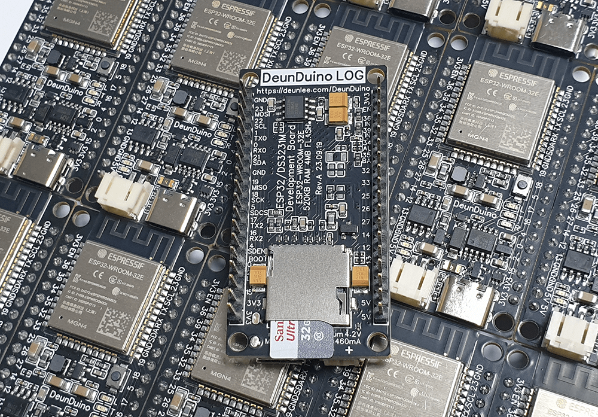
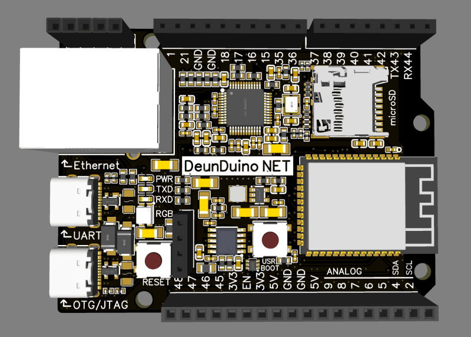
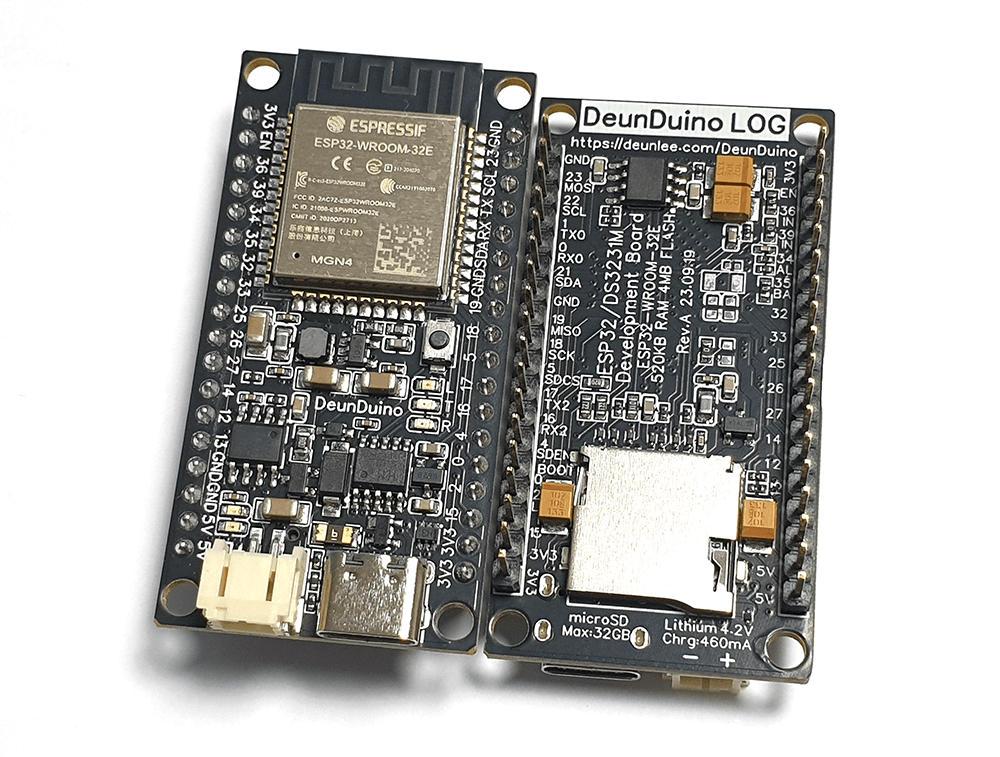
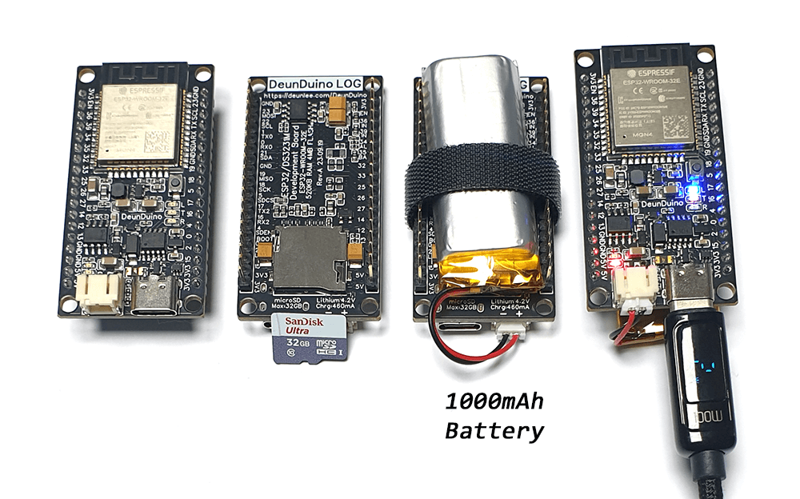
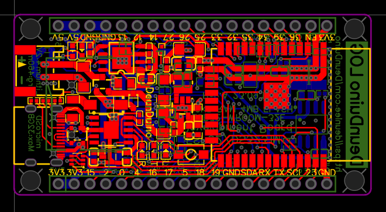
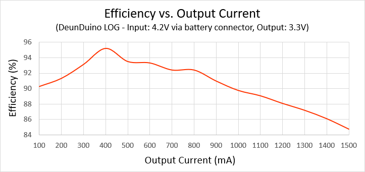
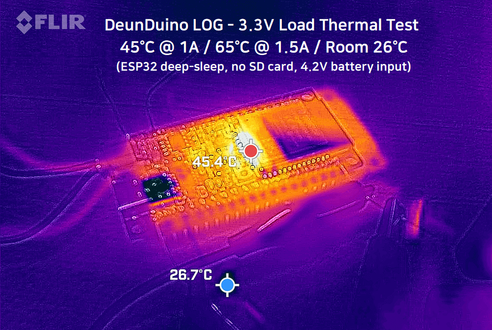
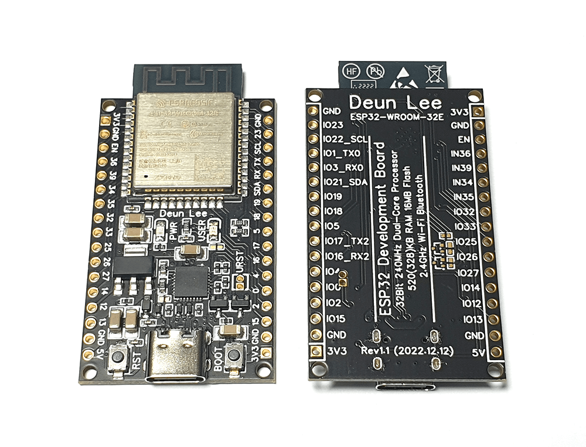

# DeunDuino

### DeunDuino - ESP32-based Arduino Development Board
I couldn't find a decent development board, so I decided to make one myself. 
There is currently no plan to sell, but for sample inquiries, send the email on the GitHub profile.

### 든두이노 - ESP32 기반 아두이노 개발 보드
맘에드는 아두이노 개발 보드가 없어서 직접 만들어 쓰기로 했습니다. 
KC 인증 비용 문제로 현재 판매 계획은 없습니다. 샘플 문의는 GitHub 프로필에 있는 이메일로 바랍니다.

## Adding boards to the PlatformIO
Currently, the DeunDuino is not registered on the PlatformIO, so you should add it manually. 
Arduino IDE is not yet supported. Instead, use the PlatformIO IDE with the Arduino framework.

1. Copy all json files under [./platformio](./platformio) to the path below.
   + `%USERPROFILE%/.platformio/platforms/espressif32/boards`
2. Copy all directories under [./platformio](./platformio) to the path below.
   + `%USERPROFILE%/.platformio/packages/framework-arduinoespressif32/variants`

## DeunDuino NET

- ESP32-S3 microcontroller (ESP32-S3-WROOM-1) with W5500 Ethernet controller
- Xtensa LX7 dual-core 32-bit CPU up to 240MHz, 512KB SRAM + 2MB PSRAM and 16MB flash memory.
- Wi-Fi (2.4GHz, IEEE 802.11b/g/n), Bluetooth LE 5 and mesh.
- Two USBs for serial and OTG/JTAG debugging.
- 100BaseTX Ethernet PHY/MAC with up to 80MHz SPI clock.
- Type-C USB connector (supports C-to-C cable and PD charger)
- microSD card slot (supports up to 32GB)
- 4 LED indicators for power, TXD, RXD, user(RGB, GPIO48)
- Additional I2C pin header for OLED display.
- Upload a sketch without pressing the boot button.
- Similar size and pinout to the Arduino Uno.
- Overcurrent protection for USB. (hold 1.1A, trip 2.2A)
- Reverse polarity protection for USB.
- ESD protection for USB and SD card.
- Multiple power sources can be input at the same time. (pin header has the highest priority)
- High-efficiency synchronous step-down converter up to 95% efficiency.
- Many ceramic capacitors for stable power supply.
- Pi-filter to reduce noise from power rail and SD card.
- 4-layer PCB design with inner ground planes to ensure return path for all signals.
- Of course, all differential pairs are length-matched.

## DeunDuino LOG

- ESP32 microcontroller (ESP32-WROOM-32E) with DS3231M RTC
- Xtensa LX6 dual-core 32-bit CPU up to 240MHz, 520KB SRAM and 4MB flash memory.
- Wi-Fi (2.4GHz, IEEE 802.11b/g/n) and Bluetooth 4.2.
- Type-C USB connector (supports C-to-C cable and PD charger)
- microSD card slot on the bottom (supports up to 32GB)
- 5 LED indicators for user(GPIO2), TXD, RXD, battery charging and battery fully charged.
- Built-in lithium battery charger (460mA, PH 2.0 connector)
- Built-in precise RTC for timekeeping in deep-sleep mode. (±5ppm, ±0.432 second/day)
- Upload a sketch without pressing the boot button.
- Same pinout as the ESP32-DevKit (except GPIO13)
- Overcurrent protection for USB. (hold 1.1A, trip 2.2A)
- Reverse polarity protection for USB and battery.
- ESD protection for USB and SD card.
- Multiple power sources can be input at the same time. (pin header has the highest priority, battery has the lowest priority)
- High-efficiency synchronous step-down converter up to 95% efficiency.
- Many ceramic/tantalum capacitors for stable power supply.
- Pi-filter to reduce noise from power rail and SD card.
- Completely blocks standby current of SD card in deep-sleep mode.
- Low deep-sleep mode current (0.1mA)
- 4-layer PCB design with inner ground planes to ensure return path for all signals.

This board is optimized for battery operation by using a high-efficiency synchronous buck converter with up to 95% efficiency instead of a low-efficiency linear regulator.
ESP32 deep-sleep mode current including DS3231M when using battery input is about 135uA.

## DeunDuino ESP (discontinued)

- ESP32 microcontroller (ESP32-WROOM-32E)
- Xtensa LX6 dual-core 32-bit CPU up to 240MHz, 520KB SRAM and 16MB flash memory.
- Wi-Fi (2.4GHz, 802.11b/g/n) and Bluetooth 4.2.
- Type-C USB connector (supports C-to-C cable and PD charger)
- 2 LED indicators for power and user(GPIO18)
- Same pinout as the ESP32-DevKit (except GPIO13)
- Many ceramic capacitors for stable power supply.
- ESD protection for USB.
